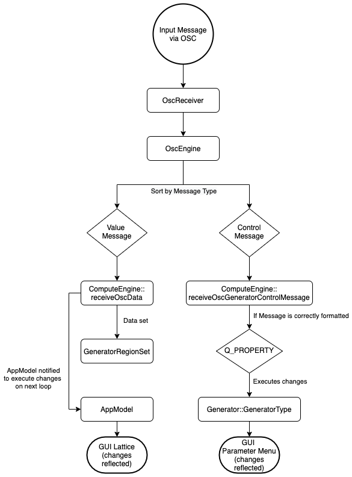

#  AutonomX OSC Documentation

### Table of Contents
* [General Description](#General-Description)
* [OSC Configuration](#OSC-Configuration)
* [OSC Messages](#OSC-Messages)
    * [Input Value Messages](#Input-Value-Messages)
    * [Paramter Control Messages](#Parameter-Control-Messages)
    * [Output Messages](#Output-Messages)
* [OSC Internal Structure](#OSC-Internal-Structure)
* [Developer Notes](#Developer-Notes)
* [See Also](#See-Also)

## General Description

This file contains the documentation of AutonomX's [OSC](http://opensoundcontrol.org/) messaging protocol and related info for its implementation.

AutonomX uses OSC messaging for passing data into and out of the program. OSC messages can be used for controlling an internal `Generator` in AutonomX, passing data to a `Generator`, or receiving data externally from a `Generator`. `Generator` objects are responsible for calculating and manipulating data, according to each `Generator` type's internal rules, which is then rendered on the lattice window in the UI.

Within this lattice window, there are also `GeneratorRegion` objects (in the form of squares with a colored outline). There are a variable amount of `GeneratorRegion` objects, which come in the form of **Input Regions** (blue/upper squares) and **Output Regions** (red/orange/lower squares). These `GeneratorRegion` objects are where data will be gathered for output (in the case of **Output Regions**) or rendered as input data to each `Generator` (in the case of **Input Regions**).

By default there are four **Input Regions** and four **Output Regions** initialized for each `Generator` at the time of creation - however, these regions can be deleted or more can be added via the UI.

On the back end side of these visible processes, OSC objects are handling the different forms of input and output information. For a diagram of the control flow of this process, see [OSC Internal Structure](#OSC-Internal-Structure).

There are three main object types used for OSC communications.

The first object is a unique, global `OscEngine` object which is responsible for managing all types of OSC communications.

The second object is one unique, global `OscReceiver` object that handles all incoming messages.

The third type of object is an `OscSender` object that handles all outgoing messages for its own specific `Generator`. `OscSender` objects are created and coupled on a 1:1 basis with each `Generator` object.

    
## OSC Configuration

There are three configurable OSC parameters:
* IN PORT
    * A single input port that is used by the `OscReceiver` object for receiving and sorting all incoming OSC messages.
* OUT PORT
    * A single, global output port that is shared by all `OscSender` objects for sorting and sending all outgoing OSC messages.
* OUT HOST
    * A single output host address for communicating with the external application (by default is set to 127.0.0.1)

These ports, as well as the output host, can be configured via the **OPTIONS** dropdown menu (located in the upper-right corner of the GUI)

These OSC parameters follow traditional OSC protocol formats and guidelines.

## OSC Messages

AutonomX implements a strict formatting system for input OSC messages. This means that input OSC messages **must** be composed according to the specific formats listed below.

NOTE: Capitalization in messages is extremely important. Generally, **Input Control Messages** follow a camelCase format for parameters, however `Generator` names are capitalized in all forms of input messages. More details below.

This strict system of message formatting exists specifically to create an automatic relationship between input OSC messages and AutonomX's `Q_PROPERTY` system. 
More information about this relationship is included below in [Developer Notes](#Developer-Notes).

### Types of OSC Messages

There are three main types of OSC messages available in AutonomX:
* **[Input Value Messages](#Input-Value-Messages)**
    * Used for inputting single or multiple values to internal `Generator` objects (via **Input Regions**)
* **[Parameter Control Messages](#Parameter-Control-Messages)**
    * Used for controlling a `Generator` object's internal parameters via an external source (application)
* **[Output Messages](#Output-Messages)**
    * Used for outputting value-based messages from AutonomX to an external application or receiver
    
Below is a detailed explanation of each type of OSC Message available in AutonomX

NOTE: the term 'value' is used below to indicate a **numerical value**, typically a floating point number. Integer, floating point, and double values are all accepted as inputs but must be positive numbers. Output values are typically returned as doubles.

### Input Value Messages

**Input Value Messages** are used for inputting single or multiple values to an internal `Generator` of AutonomX. This type of message must target a *single* `Generator` at a time but can vary in terms of the amount of **Input Regions** affected at a time.

There are two formats of **Input Value Messages**:
* **[List Value Messages](#List-Value-Messages)**
* **[Single Region Value Messages](Single-Region-Value-Messages)**

---
#### List Value Messages

List Value Messages are used for inputting simultaneous values to a variable amount of **Input Regions** of a single `Generator`.
Essentially, this type of message allows the user to send different values to any number of **Input Regions** using a single message. This is the most flexible type of input message but requires the user to manually keep track of which values are being sent to which **Input Regions**. The values entered in the message are mapped to **Input Regions** in the order they are listed (i.e. first value goes to region1, second value to region2, etc.).

The general format for **List Value Messages** is:

`/<GeneratorName_##>/input <v1> <v2> <v3>...<vn>`

where:

* `<GeneratorName_##>` 

    * corresponds to an existing Generator (listed in left-hand collapsible menu)

* `<v1> <v2> <v3>...<vn>` 
    * corresponds to an input value, using *one value per* **Input Region**, with the values being assigned in the order they are entered.

Example: `/SpikingNet_01/input 0.5 1 1 0.5`
* in the case of a `SpikingNet` `Generator`, this message would result in the first and fourth **Input Regions** being sent a value of 0.5 each and the second and third **Input Regions** being sent a value of 1.0 each.
        
---
#### Single Region Value Messages

Single Region Value Messages are used for inputting a *single* value to a *single* **Input Region** of a single `Generator` - giving it a 1:1:1 relationship of value:inputRegion:generator.
This type of message is used for explicitly controlling one **Input Region** at a time, and thus is less flexible than List Value Messages. However, as the message explicitly states the **Input Region** which will receive the value, this type of message is more precise.

The general format for **Single Region Value Messages** is:

`/<GeneratorName_##>/input/<Rn> <v1>`

where:
* `<GeneratorName_##>`
    * corresponds to an existing Generator (listed in left-hand collapsible menu)
* `<Rn>` 
    * corresponds to the targeted **Input Region** number (according to the label in the upper right-hand corner of the region. This label becomes visible when the cursor hovers over the region)
* `<v1>` 
    * corresponds to a single input value

Example: `/SpikingNet_01/input/3 0.5`
* would result in only the third **Input Region** of `SpikingNet_01` being sent a value of 0.5. All other regions would be ignored.

Note that these received values can be entered as either floating point, double, or integer values - but will be converted to double values upon receipt. 

Also note again that `Generator` names must be capitalized, with the underscore between the name and ID number of the **Generator**, so that the input messages exactly matches the name of the **Generator** visible in the GUI. All active `Generator` objects are listed in the left-hand collapsible menu.

For more information about how incoming messages are translated into values that affect the visual lattice and, vice versa, how values on the visual lattice are translated to outgoing values, see each individual `Generator` type's description.
(i.e. a `SpikingNet` will not resolve incoming values or generate outgoing values the same way as a `WolframCA` `Generator` etc.)

---
### Parameter Control Messages

**Input Control Messages** are messages that are used for controlling the internal parameters of an existing `Generator` via an external application that uses `OSC`.
These messages allow the user to adjust any desired parameter of any `Generator` with a single `OSC` message - without interacting with the GUI. This can be useful for live performances, remote setup, etc.

NOTE: **Input Control Messages** follow a strict format that corresponds to AutonomX's `Q_PROPERTY` system, such that the name of the targeted parameter usually exactly matches the corresponding `Q_PROPERTY` which executes it.
A detailed explanation for how this works and, as a developer, how to create customized control messages (for exisiting or future `Generator` types) can be found in the **[Developer Notes](#Developer-Notes)** section.

The general formats for **Parameter Control Messages** are:

* `/<GeneratorName_##>/parameter/<ParameterName> <v1>`
    * For adjusting a parameter via a changed value

* `/<GeneratorName_##>/parameter/<ParameterName>/<bool>`
    * For turning on/off a parameter via a boolean

* `/<GeneratorName_##>/parameter/<ParameterName>/<n1>`
    * For adjusting a parameter to an option from a drop-down menu
    * Note the extra `/` after `<ParameterName>` and before `<n1>`

where:
* `<GeneratorName_##>` 
    * corresponds to an existing Generator (listed in left-hand collapsible menu)
* `<ParameterName>` 
    * corresponds to the desired **Parameter** name (see [Parameter Names](#Parameter-Names) below for more details)
* `<v1>` 
    * corresponds to a single input value
* `<bool>` 
    * corresponds to a single boolean value, typed out literally as `on` or `off`
* `<n1>` 
    * corresponds to a single value that matches with some parameter's drop-down menu (i.e. by substituting in `<n1>` a value of `1`, the first option listed in the drop down menu can be selected, `2` for the second option, etc.)

Example: `/SpikingNet_01/parameter/width 45`
* would result in the `width` of `SpikingNet_01` being changed to 45

Example: `/SpikingNet_01/parameter/decayHalfLife/on`
* would result in the `decayHalfLife` of `SpikingNet_01` being turned on

Example: `/SpikingNet_01/parameter/inhibitoryNeuronType/1`
* would result in the `inhibitoryNeuronType` of `SpikingNet_01` being changed to `Spiking`

#### Parameter Names

Formatting of Paramter Control Messages requires that the **exact** parameter name in the message can be matched with an internal parameter of a `Generator` in AutonomX. Details on why this is done can be found in [Developer Notes](#Developer-Notes) but the general principle for the naming conventions is:
* camelCase enforced
    * the first letter of every parameter will be lower-case, but if the parameter name contains more than one word the first letter of all subsequent words will be capitalized
* no spaces allowed
    * if the parameter is composed of two words (ex: Excitatory Noise), they will be combined into one word, no spaces, using camelCase (ex: `excitatoryNoise`)

**NOTE**: there are currently two exceptions to this general rule:
* STP Strength = `STPStrength`
* STDP Strength = `STDPStrength`

---

### Output Messages

Currently, Output OSC Messages in AutonomX are used for relaying values from the **Output Regions** (red/orange/lower squares on the lattice) of each implemented `Generator` **simultaneously**. In other words, **each** `Generator` object will output a single value, per **Output Region**, per loop. The speed of this loop - and corresponding changes to the `Generator` - is affected by the `Speed` parameter in each `Generator` parameter menu.

Each `Generator` outputs two types of messages per loop:
* one aggregate **List Message**
* one **set** of **Individual Value Messages**

The formats for these two types of messages are:

`/<GeneratorName_##>/output <v1> <v2> <v3>...<vn>`
*  the **List Message** which contains each output value from each **Output Region** in a **list**, as a single message

and, as a series of messages:

`/<GeneratorName_##>/output/<R1> <v1>`

`/<GeneratorName_##>/output/<R2> <v2>`

`...`

`/<GeneratorName_##>/output/<Rn> <vn>`
* the **Individual Value Messages** which are a series of **separate messages** where each output value (`<v1>...<vn>`) is sent individually with its corresponding **Output Region** (`<R1>...<Rn>`)

These formats for Output Messages are currently not variable, thus parsing in the external (receving) application is necessary. Further functionality for Output OSC Messages is planned.

## OSC Internal Structure

Below is an image that depicts the sequence of events that occur upon receipt of an OSC message from an external source into AutonomX.

As can be seen above, messages are first received by the `OscReceiver` object where they are formatted and sent to the `OscEngine` object.

This global OscEngine object will receive all external INPUT messages and then forward them on to their specific execution method (either `receiveOscData` for **Value Messages** or `receiveOscGeneratorControlMessage` for **Parameter Control Messages**) in the global ComputeEngine, which is responsible for scheduling `Generator` calculations. 

From there, in the case of a **Value Message**, the data will be sent to the desired `GeneratorRegion`(s) and `AppModel` will be alerted to execute these changes on the next `Loop`. In the case of a **Parameter Control Message**, `ComputeEngine` will directly call the corresponding `Q-PROPERTY` and the correct `Generator` will execute the changes. In both cases, changes will be reflected in the UI - either on the lattice or in the specified `Generator` parameter menu.

Further details about the control flow Output OSC Messages will be added in later releases.

## Developer Notes

This section is intended for detailed use by potential third-party developers who wish to [create their own `Generator` types](GENERATOR.md) (or alter existing types) and want the corresponding `Generator` parameters to be adjustable via Input OSC Messages.

First, it is important to understand that the strict formatting of **Parameter Control Messages** stems from AutonomX's reliance on [QT's `Q_PROPERTY` system](https://doc.qt.io/qt-5/properties.html). AutonomX takes advantage of the fact that `Q_PROPERTY` messages are thread safe, allowing the program to communicate across threads without crashing. The `Q_PROPERTY` is a very powerful tool and we strongly recommend utilizing it if implementing a new `Generator` - especially because this is also how the **Parameter Control Messages** are passed to each `Generator`.

As `Q_PROPERTY` calls require a string to exactly match some function that is registered with the [`Q_Meta_Object` system](https://doc.qt.io/qt-5/metaobjects.html), **Parameter Control Messages** must perfectly match the registered name as well.

Thus, in order to successfully complete the link between an incoming **Parameter Control Message** to a `Q_PROPERTY` to executing a change in a `Generator` parameter, the property name used in this `Q_PROPERTY` *must exactly match the string passed in the incoming Parameter Control Message*.

For example, in [`SpikingNet.h`](../autonomx/SpikingNet.h), there is a line that reads:

>`Q_PROPERTY(double inhibitoryPortion READ getInhibitoryPortion WRITE writeInhibitoryPortion NOTIFY inhibitoryPortionChanged)`

This property name, `inhibitoryPortion`, is exactly the string that must be passed in a **Parameter Control Message** in order to affect that parameter.

Example: `/SpikingNet_01/parameter/inhibitoryPortion 10`

Thus, if you wanted to create a new `Generator`, called `GenZ`, which had some adjustable parameter, called `cellGrowth`, the following would need to be included in the header file (in keeping with `Q_PROPERTY` convention):

`Q_PROPERTY(double cellGrowth READ getCellGrowth WRITE writeCellGrowth NOTIFY cellGrowthChanged)`

and the corresponding **Parameter Control Message** could be written as:

`/GenZ_02/parameter/cellGrowth 100`

The universality of the `Q_PROPERTY` system is such that, if these formats and mechanisms are respected when writing a new `Generator` type / class, no extra lines of code need to be added to the  `ComputeEngine` or `Generator` classes - the `Q_PROPERTY` system will find the correct parameter match and execute the change automatically.

## See Also

Further references and material related to AutonomX's OSC system:

[OSC Wikipedia](https://en.wikipedia.org/wiki/Open_Sound_Control)

[Open Sound Control Website](http://opensoundcontrol.org/)

[QT Wiki](https://wiki.qt.io/Main)

[QObject Documentation](https://doc.qt.io/qt-5/qobject.html)
